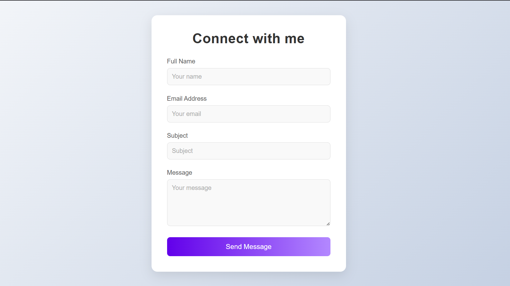

# Contact Form - Connect Via Email

A simple Node.js project that provides a contact form for users to send messages directly to your email. The form features a modern, responsive design with a dynamic loading spinner, client-side validation, and styled success/error messages. The backend uses Express and Nodemailer to securely send emails to a configured Gmail account. Perfect for personal portfolios, small businesses, or anyone looking to add a contact feature to their website.

---

## ✨ Features

- **Responsive Contact Form**: Collects full name, email, subject (optional), and message.
- **Dynamic Loading Animation**: Purple spinner with "Sending..." during form submission.
- **Client-Side Validation**: Ensures required fields are filled before sending.
- **Styled Feedback**: 
  - ✅ Green gradient for success.
  - ❌ Red gradient for errors, auto-hides after 5 seconds.
- **Email Integration**: Sends formatted emails via Gmail using Nodemailer.
- **Security**: Uses `.env` for sensitive data.
- **Accessibility**: `aria-busy` for screen readers.
- **Input Locking**: Prevents multiple submissions.

---

## 🛠 Tech Stack

### Frontend
- HTML (`index.html`)
- CSS (`styles.css`)
- JavaScript (`main.js`)

### Backend
- Node.js
- Express.js
- Nodemailer

### Configuration & Dependencies
- `dotenv`, `express`, `body-parser`, `nodemailer`

---

## 📦 Prerequisites

- [Node.js](https://nodejs.org/) (v20)
- [Gmail account with App Password](https://support.google.com/accounts/answer/185833)
- Basic knowledge of HTML, CSS, JavaScript, CLI

---

## 🚀 Installation

1. **Clone the Repository**:
   ```bash
   git clone <your-repository-url>
   cd contact-form
2. **Install Dependencies**:
   ```bash
   npm install
3. **Configure Environment Variables**:
   Create a `.env` file in the project root and add your Gmail credentials:

   ```env
   EMAIL_USER=your-email@gmail.com
   EMAIL_PASS=your-app-specific-password
   PORT=3000
- `EMAIL_USER`: Your Gmail address.
- `EMAIL_PASS`: A Gmail App Password (How to create one).
- `PORT`: The port your app runs on (default is 3000).

⚠️ **Important**: Do not commit your `.env` file — it's included in `.gitignore` to keep your credentials safe.

4. **Run the Application**:

   ```bash
   node server.js
If everything is set up correctly, you’ll see:
    ```bash
    🚀 Server running at http://localhost:3000


---
### 📸 Screenshot

Here’s what the contact form looks like:



> _Tip: Replace `screenshot.png` with your actual image file. You can use a hosted URL or place a local image in the root directory._

---

## 🌐 Usage

1. Open a browser and go to: [http://localhost:3000](http://localhost:3000)
2. Fill in the form:
   - **Full Name** (required)
   - **Email Address** (required, must be valid)
   - **Subject** (optional)
   - **Message** (required)
3. Click the **"Send Message"** button.

### What Happens Next:
- A purple spinner with “Sending...” appears.
- Form fields are disabled.
- ✅ On success: A green success message appears.
- ❌ On error: A red error message appears and disappears after 5 seconds.

You’ll receive an email at your configured Gmail address with:
- **Subject**: User-provided subject or “New message from [Name]”
- **Content**: Formatted message including name, email, subject, and message
- **Reply-To**: Set to the user’s email for direct response

---

## 📁 File Structure

      contact-form/
        ├── index.html        # Main HTML file with the contact form structure
        ├── styles.css        # Separate CSS file for styling (gradients, animations, responsive design)
        ├── main.js           # Client-side JavaScript for form submission, validation, and UI feedback
        ├── server.js         # Node.js/Express backend to serve files and send emails
        ├── .env              # Environment variables for email credentials (not committed)
        ├── .gitignore        # Ignores node_modules and .env
        ├── package.json      # Project metadata and dependencies
        ├── package-lock.json # Locks dependency versions for consistent installs
        ├── README.md         # This documentation file
        └── screenshot.png # Project screenshot


---

## 🎨 Customization

### Style Tweaks (`styles.css`):
- Change button color (`#6200ea` to another hex code)
- Modify spinner styles or alert message gradients

Example:
    ```css
    .spinner {
    border: 3px solid #2e6b2e; /* Makes the spinner green */
    }

## Form Behavior (`main.js`)

- Change timeout duration for error messages
- Customize success message text
- Enhance email validation logic


## Example:
    // To reset instead of clearing form on success
    contactForm.reset(); // instead of formContainer.innerHTML = ''


## Email Content (`server.js`)

Edit `mailOptions` to format email HTML/text as you like.

You can:
- Add branding
- Insert useful links
- Include images


---

## 🔐 Security Notes

- Store sensitive data like email credentials in a `.env` file.
- Use a [Gmail App Password](https://support.google.com/accounts/answer/185833) instead of your main Gmail password for secure email sending.
- Make sure `.env` is included in your `.gitignore` to prevent accidental commits of sensitive data.

### 🔒 Recommended Enhancements

- **Input Sanitization**: Prevent XSS (Cross-site Scripting) by sanitizing user inputs.

       ```bash
   npm install sanitize-html
     


     ```js
     const sanitizeHtml = require('sanitize-html');
     const cleanMessage = sanitizeHtml(req.body.message);


## Rate Limiting

Prevent spam or abuse by limiting how often the form can be submitted.

### Installation

```bash
npm install express-rate-limit


```js

const rateLimit = require('express-rate-limit');

const limiter = rateLimit({
  windowMs: 60 * 1000, // 1 minute
  max: 5 // limit each IP to 5 requests per minute
});

app.use('/contact', limiter);

- `HTTPS`: For production, always use HTTPS to encrypt form submissions. This can be set up using services like Let’s Encrypt or handled by your hosting provider.


```vbnet
Let me know if you'd like me to expand any example or tailor it to your specific use case!


## 🚀 Deployment

Deploy this project using platforms like **Render**, **Heroku**, **Vercel**, or any Node.js-compatible hosting provider.

### Steps:

1. **Prepare Files**:  
   Ensure the following files are included and committed:
   - `index.html`
   - `styles.css`
   - `main.js`
   - `server.js`
   - `.env` (excluded from version control)
   - `package.json` with a proper start script:
     ```json
     "scripts": {
       "start": "node server.js"
     }
     ```

2. **Set Environment Variables**:  
   Configure `EMAIL_USER`, `EMAIL_PASS`, and `PORT` on your hosting platform’s environment/dashboard.

3. **Update API URL**:  
   In `main.js`, replace:
   ```js
   fetch('/contact')

```js

fetch('https://your-deployed-domain.com/contact')


 4. **Deploy**:

Follow your platform's deployment steps.

**Example for Render:**

- Create a new Web Service
- Set Build Command: `npm install`
- Set Start Command: `node server.js`
- Add your environment variables

---

## 🛠 Troubleshooting

### 📧 Email Not Sending:
- Double-check `.env` values
- Regenerate your Gmail App Password if necessary
- Check spam/junk folders
- Look for Gmail security alerts

### 🚫 Form Submission Fails:
- Open DevTools → Console & Network tab for errors
- Ensure server is running and accessible
- Confirm your fetch URL is correct
- Test `/contact` with Postman or curl

### 🎨 Styling or Spinner Not Showing:
- Make sure `styles.css` is linked correctly in `index.html`
- Verify `.spinner` class exists and isn’t being overridden
- Confirm no 404s for static assets in DevTools → Network tab

### 🖥 Server Errors:
- Run `npm install` to ensure all dependencies are installed
- Make sure no other process is using your desired port
- Look at the terminal where `node server.js` is running for logs

---

### ✅ Example Workflow

1. User opens `http://localhost:3000`
2. Fills in the form:
   - Name: Mr. XYZ
   - Email:  xyz@example.com
   - Subject: Hello
   - Message: I’d like to connect!
3. Clicks **Send Message**
4. Sees purple loading spinner and "Sending..." message

5. On success:
- Form is replaced with a green success message
- Email arrives in your inbox

6. On error:
- A red message appears (e.g., "Failed to send message. Please try again.")
- Message auto-hides after 5 seconds

---

## 🤝 Contributing

Contributions are welcome!

1. Fork this repository
2. Create a new branch:
  ```bash
git checkout -b feature/your-feature-name

3. Make your changes and commit:
   ```bash
git commit -m "Add new feature"

4. Push to your fork:
  ```bash
git push origin feature/your-feature-name


 5. Open a Pull Request

To contribute, please follow these steps:

- Fork this repository
- Create a new branch
- Make your changes
- Open a pull request with a clear description of what you’ve done

You can also report bugs or request features via [Issues](<your-repository-url>/issues)


---

## 📬 Contact

Created by **[Your Name]**  
For questions, feedback, or collaboration, feel free to:

- Use the [contact form](http://localhost:3000)
- Or email me directly at [your-email@example.com](mailto:your-email@example.com)

> Replace with your actual name and email if publishing publicly.

